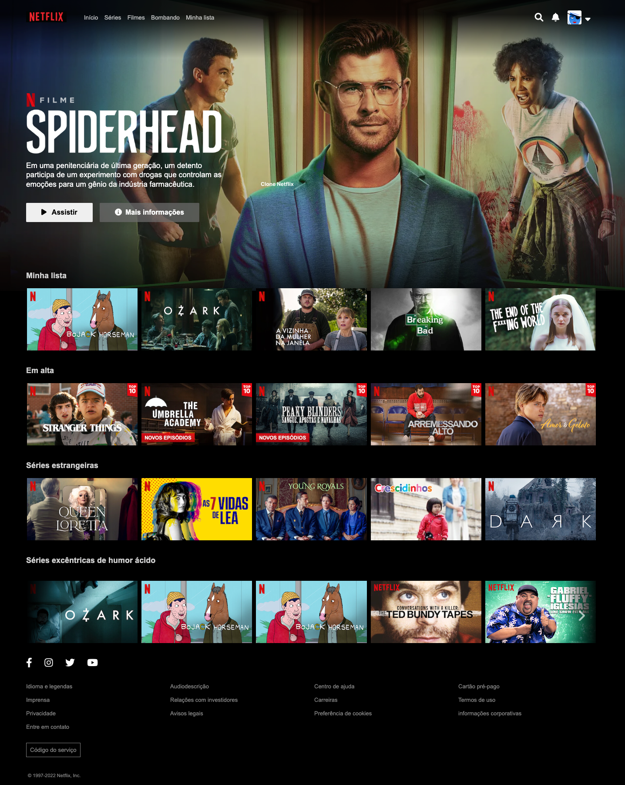

# #07daysOfCode - HTML e CSS  👩🏾‍💻 

&nbsp;
&nbsp;
&nbsp;
&nbsp;
&nbsp;
 

### Desafio proposto por [Fernanda Degolin e Alura](https://7daysofcode.io/matricula/html-css-netflix) com o objetivo de colocar em prática os conhecimentos de HTML e CSS, por 7 dias.  Além do que foi proposto, adicionei responsividade ao projeto e um menu mobile utilizando JavaScript.  

### Qual será o desafio?  
>**Desenvolver uma réplica da página de filmes e séries da Netflix.**  

Acesse o protótipo do site no 
[Figma](https://www.figma.com/file/boX9zUOYGNRuadqPh4JwwE/Alura?node-id=0%3A1&t=6u2GLOiwZ0zAnYoU-0).

